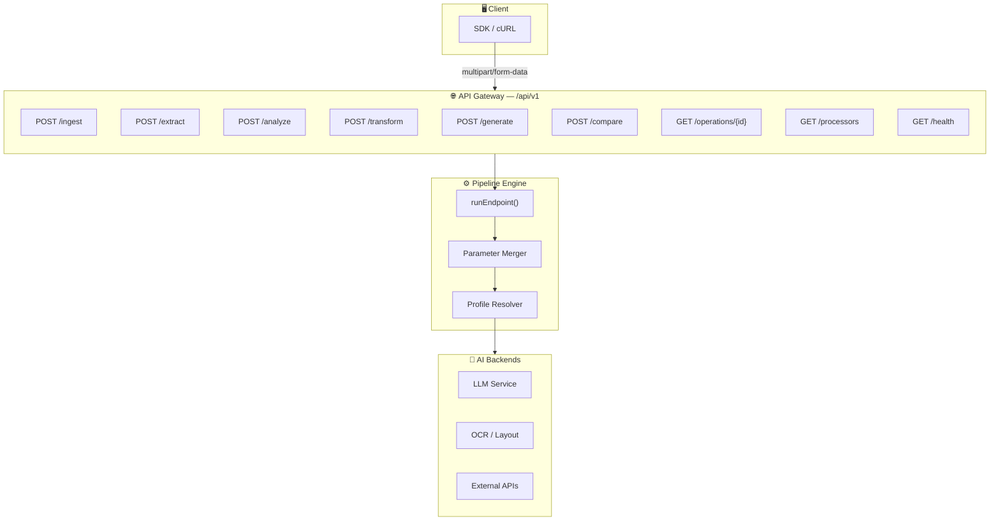

# 🏗️ Document Understanding API — Thiết kế tối ưu

> **Triết lý:** Số API ít nhất, bao trùm nhiều nhất. Mỗi service là một **verb** (hành động chính), các biến thể dùng **tham số** để điều khiển.

## Tổng quan Architecture



---

## Bộ API đề xuất — 6 Services + 3 Management

| #  | Endpoint               | Mô tả                              | Số sub-cases |
|----|------------------------|-------------------------------------|:------------:|
| 1  | `POST /api/v1/ingest`  | Nhập & tiền xử lý tài liệu         | 4            |
| 2  | `POST /api/v1/extract` | Trích xuất dữ liệu có cấu trúc     | 6            |
| 3  | `POST /api/v1/analyze` | Phân tích & đánh giá nội dung       | 7            |
| 4  | `POST /api/v1/transform` | Chuyển đổi định dạng / nội dung   | 5            |
| 5  | `POST /api/v1/generate`  | Tạo nội dung mới từ tài liệu      | 6            |
| 6  | `POST /api/v1/compare`   | So sánh 2 tài liệu                | 3            |
| 7  | `GET /api/v1/operations/{id}` | Theo dõi tiến trình           | —            |
| 8  | `GET /api/v1/processors` | Danh sách capabilities             | —            |
| 9  | `GET /api/v1/health`     | Health check                       | —            |

> **Tổng: 9 endpoints** cho toàn bộ hệ thống (so với 11+ endpoints hiện tại)

---

## 1. `POST /api/v1/ingest` — Nhập tài liệu

> **Mục đích:** Tiền xử lý tài liệu trước khi đưa vào các service khác. Chuẩn hóa input.

### Tham số chính

| Tham số | Kiểu | Bắt buộc | Mô tả |
|---------|------|:--------:|-------|
| `file` | binary | ✅ | File tài liệu (PDF, DOCX, XLSX, hình ảnh) |
| `mode` | string | ✅ | Chế độ nhập: `ocr`, `parse`, `digitize`, `split` |
| `output_format` | string | — | `md`, `html`, `text`, `json` (default: `md`) |
| `pages` | string | — | Chỉ xử lý trang cụ thể: `"1-5"`, `"1,3,7"` |
| `language` | string | — | Ngôn ngữ OCR: `vi`, `en`, `ja`, `zh` |
| `dpi` | int | — | Độ phân giải OCR (default: `300`) |

### Các sub-case theo `mode`

#### 📄 `mode=parse` — Parse cấu trúc tài liệu
```bash
curl -X POST /api/v1/ingest \
  -F "file=@report.pdf" \
  -F "mode=parse" \
  -F "output_format=md"
```
- Đọc cấu trúc PDF/DOCX, giữ nguyên heading, bảng, list
- **Không dùng AI** — xử lý bằng layout parser
- Tương đương `prebuilt-layout` hiện tại

#### 🔍 `mode=ocr` — Nhận dạng ký tự (OCR)
```bash
curl -X POST /api/v1/ingest \
  -F "file=@scan.jpg" \
  -F "mode=ocr" \
  -F "language=vi"
```
- Dùng cho ảnh scan, fax, tài liệu chụp
- Hỗ trợ multi-language qua `language`

#### 📱 `mode=digitize` — Số hóa tài liệu thủ công
```bash
curl -X POST /api/v1/ingest \
  -F "file=@handwritten_form.jpg" \
  -F "mode=digitize"
```
- **Dùng AI Vision** để đọc handwritten text
- Kết hợp OCR + LLM để hiểu context

#### ✂️ `mode=split` — Tách tài liệu nhiều trang
```bash
curl -X POST /api/v1/ingest \
  -F "file=@combined.pdf" \
  -F "mode=split" \
  -F "pages=1-5"
```
- Tách range trang cụ thể
- Trả về file mới hoặc text content

---

## 2. `POST /api/v1/extract` — Trích xuất dữ liệu

> **Mục đích:** Lấy thông tin có cấu trúc từ tài liệu. Output luôn là JSON.

### Tham số chính

| Tham số | Kiểu | Bắt buộc | Mô tả |
|---------|------|:--------:|-------|
| `file` | binary | ✅ | File tài liệu |
| `type` | string | ✅ | Loại trích xuất: `invoice`, `contract`, `id-card`, `receipt`, `table`, `custom` |
| `fields` | string | — | Danh sách trường cần trích (cho `custom`) |
| `schema` | string | — | JSON Schema mô tả output mong muốn |
| `output_format` | string | — | `json` (default), `csv`, `xlsx` |

### Các sub-case theo `type`

#### 🧾 `type=invoice` — Trích xuất hóa đơn
```bash
curl -X POST /api/v1/extract \
  -F "file=@invoice.pdf" \
  -F "type=invoice"
```
**Output JSON:**
```json
{
  "vendor_name": "Công ty ABC",
  "invoice_number": "INV-2026-001",
  "date": "2026-03-31",
  "total_amount": 15000000,
  "currency": "VND",
  "line_items": [
    { "description": "Dịch vụ tư vấn", "quantity": 1, "unit_price": 15000000 }
  ],
  "tax_info": { "tax_id": "0123456789", "tax_rate": 0.1 }
}
```

#### 📋 `type=contract` — Trích xuất hợp đồng
```bash
curl -X POST /api/v1/extract \
  -F "file=@contract.pdf" \
  -F "type=contract"
```
- Trích: bên A/B, điều khoản, ngày ký, giá trị, phạm vi công việc

#### 🪪 `type=id-card` — Trích xuất CMND/CCCD/Passport
```bash
curl -X POST /api/v1/extract \
  -F "file=@cccd_front.jpg" \
  -F "type=id-card"
```
- Trích: họ tên, ngày sinh, số CCCD, ngày cấp, nơi cấp

#### 🧾 `type=receipt` — Trích xuất biên lai / phiếu thu
```bash
curl -X POST /api/v1/extract \
  -F "file=@receipt.jpg" \
  -F "type=receipt"
```
- Trích: tổng tiền, ngày, cửa hàng, danh sách item

#### 📊 `type=table` — Trích xuất bảng biểu
```bash
curl -X POST /api/v1/extract \
  -F "file=@report.pdf" \
  -F "type=table" \
  -F "output_format=csv"
```
- Detect & extract toàn bộ bảng trong tài liệu
- Output: JSON array hoặc CSV

#### 🔧 `type=custom` — Trích xuất tùy chỉnh
```bash
curl -X POST /api/v1/extract \
  -F "file=@document.pdf" \
  -F "type=custom" \
  -F 'fields=tên người ký, chức vụ, ngày ký, nội dung chính' \
  -F 'schema={"type":"object","properties":{"signer":{"type":"string"},"position":{"type":"string"}}}'
```
- Client tự định nghĩa trường cần trích
- Có thể cung cấp JSON Schema cho output

---

## 3. `POST /api/v1/analyze` — Phân tích & Đánh giá

> **Mục đích:** Hiểu sâu nội dung tài liệu, đưa ra nhận xét, đánh giá, phân loại.

### Tham số chính

| Tham số | Kiểu | Bắt buộc | Mô tả |
|---------|------|:--------:|-------|
| `file` | binary | ✅ | File tài liệu |
| `task` | string | ✅ | Loại phân tích: `classify`, `sentiment`, `compliance`, `fact-check`, `quality`, `risk`, `summarize-eval` |
| `reference_data` | string | — | Dữ liệu tham chiếu (cho `fact-check`, `compliance`) |
| `categories` | string | — | Danh mục phân loại (cho `classify`) |
| `criteria` | string | — | Tiêu chí đánh giá (cho `quality`, `compliance`) |
| `rules` | string | 🔒 | Admin-only: business rules per profile |

### Các sub-case theo `task`

#### 🏷️ `task=classify` — Phân loại tài liệu
```bash
curl -X POST /api/v1/analyze \
  -F "file=@document.pdf" \
  -F "task=classify" \
  -F "categories=hóa đơn,hợp đồng,biên bản,công văn,báo cáo"
```
**Output:**
```json
{
  "classification": "hợp đồng",
  "confidence": 0.95,
  "sub_type": "hợp đồng dịch vụ",
  "reasoning": "Tài liệu chứa các điều khoản, bên A/B, giá trị hợp đồng..."
}
```

#### 😊 `task=sentiment` — Phân tích cảm xúc / giọng điệu
```bash
curl -X POST /api/v1/analyze \
  -F "file=@customer_review.pdf" \
  -F "task=sentiment"
```
**Output:**
```json
{
  "overall_sentiment": "negative",
  "score": -0.7,
  "aspects": [
    { "topic": "chất lượng sản phẩm", "sentiment": "negative", "score": -0.8 },
    { "topic": "dịch vụ khách hàng", "sentiment": "neutral", "score": 0.1 }
  ]
}
```

#### ✅ `task=compliance` — Kiểm tra tuân thủ
```bash
curl -X POST /api/v1/analyze \
  -F "file=@contract.pdf" \
  -F "task=compliance" \
  -F "criteria=Kiểm tra theo Luật Lao động 2019, điều 13-25"
```
**Output:**
```json
{
  "verdict": "WARNING",
  "compliance_score": 72,
  "issues": [
    { "clause": "Điều 15", "status": "FAIL", "detail": "Thiếu quy định về thử việc" },
    { "clause": "Điều 20", "status": "PASS", "detail": "Thời hạn hợp đồng hợp lệ" }
  ]
}
```

#### 🔍 `task=fact-check` — Kiểm chứng dữ liệu
```bash
curl -X POST /api/v1/analyze \
  -F "file=@invoice.pdf" \
  -F "task=fact-check" \
  -F 'reference_data={"vendor": "ABC Corp", "amount": 15000000, "date": "2026-03-30"}'
```
**Output:**
```json
{
  "verdict": "FAIL",
  "score": 65,
  "results": [
    { "field": "vendor", "doc_value": "ABC Corp", "ref_value": "ABC Corp", "match": true },
    { "field": "amount", "doc_value": 14500000, "ref_value": 15000000, "match": false }
  ],
  "discrepancies": [
    { "field": "amount", "severity": "HIGH", "detail": "Chênh lệch 500,000 VND" }
  ]
}
```

#### 📝 `task=quality` — Đánh giá chất lượng văn bản
```bash
curl -X POST /api/v1/analyze \
  -F "file=@report.pdf" \
  -F "task=quality" \
  -F "criteria=văn phong hành chính, chính tả, logic"
```
**Output:**
```json
{
  "overall_score": 82,
  "dimensions": {
    "grammar": 90,
    "coherence": 85,
    "style": 70,
    "completeness": 83
  },
  "issues": [
    { "type": "grammar", "location": "trang 3, đoạn 2", "detail": "Lỗi chính tả: 'ngiên cứu' → 'nghiên cứu'" }
  ]
}
```

#### ⚠️ `task=risk` — Đánh giá rủi ro
```bash
curl -X POST /api/v1/analyze \
  -F "file=@contract.pdf" \
  -F "task=risk"
```
- Phát hiện điều khoản bất lợi, rủi ro pháp lý, thiếu sót

#### 📊 `task=summarize-eval` — Tóm tắt + Đánh giá tổng hợp
```bash
curl -X POST /api/v1/analyze \
  -F "file=@proposal.pdf" \
  -F "task=summarize-eval" \
  -F "criteria=khả thi, ngân sách, timeline"
```
- Vừa tóm tắt vừa đánh giá theo tiêu chí

---

## 4. `POST /api/v1/transform` — Chuyển đổi

> **Mục đích:** Biến đổi nội dung hoặc định dạng tài liệu.

### Tham số chính

| Tham số | Kiểu | Bắt buộc | Mô tả |
|---------|------|:--------:|-------|
| `file` | binary | ✅ | File tài liệu nguồn |
| `action` | string | ✅ | `convert`, `translate`, `rewrite`, `redact`, `template` |
| `output_format` | string | — | `md`, `html`, `text`, `json`, `docx` |
| `target_language` | string | — | Ngôn ngữ đích (cho `translate`) |
| `tone` | string | — | Giọng điệu (cho `rewrite`, `translate`) |
| `style` | string | — | Phong cách (cho `rewrite`) |
| `template` | string | — | Template output (cho `template`) |

### Các sub-case theo `action`

#### 🔄 `action=convert` — Chuyển đổi định dạng
```bash
curl -X POST /api/v1/transform \
  -F "file=@report.docx" \
  -F "action=convert" \
  -F "output_format=md"
```
- PDF → Markdown, DOCX → HTML, v.v.
- Tương đương `prebuilt-layout` hiện tại

#### 🌐 `action=translate` — Dịch thuật
```bash
curl -X POST /api/v1/transform \
  -F "file=@contract_en.pdf" \
  -F "action=translate" \
  -F "target_language=vi" \
  -F "tone=formal"
```

**Các biến thể `tone`:**

| `tone` | Mô tả | Use case |
|--------|--------|----------|
| `formal` | Trang trọng, hành chính | Văn bản pháp lý, công văn |
| `casual` | Thân mật, dễ hiểu | Email, blog |
| `technical` | Chuyên ngành | Tài liệu kỹ thuật |
| `literary` | Văn chương | Sách, bài viết |
| `business` | Thương mại | Đề xuất, báo cáo kinh doanh |

#### ✍️ `action=rewrite` — Viết lại / Cải thiện
```bash
curl -X POST /api/v1/transform \
  -F "file=@draft.pdf" \
  -F "action=rewrite" \
  -F "style=academic" \
  -F "tone=formal"
```
- Viết lại nội dung theo phong cách khác
- Giữ nguyên ý nghĩa, đổi cách diễn đạt

**Các biến thể `style`:**

| `style` | Mô tả |
|---------|--------|
| `academic` | Học thuật, trích dẫn |
| `executive` | Ngắn gọn, đi thẳng vào vấn đề |
| `simplified` | Đơn giản hóa, dễ hiểu |
| `expanded` | Mở rộng, chi tiết hơn |
| `bullet_points` | Dạng gạch đầu dòng |

#### 🔒 `action=redact` — Che thông tin nhạy cảm
```bash
curl -X POST /api/v1/transform \
  -F "file=@report.pdf" \
  -F "action=redact"
```
- Tự động detect & che PII (số CCCD, SĐT, email, địa chỉ)
- Output: file mới với thông tin đã được anonymize

#### 📑 `action=template` — Áp dụng template
```bash
curl -X POST /api/v1/transform \
  -F "file=@data.json" \
  -F "action=template" \
  -F "template=invoice_template_v2"
```
- Đổ dữ liệu vào template có sẵn
- Tạo tài liệu hoàn chỉnh từ data + template

---

## 5. `POST /api/v1/generate` — Tạo nội dung

> **Mục đích:** Sinh nội dung mới dựa trên tài liệu đầu vào.

### Tham số chính

| Tham số | Kiểu | Bắt buộc | Mô tả |
|---------|------|:--------:|-------|
| `file` | binary | ✅ | File tài liệu nguồn |
| `task` | string | ✅ | `summary`, `qa`, `outline`, `report`, `email`, `minutes` |
| `max_words` | int | — | Giới hạn từ output |
| `format` | string | — | `paragraph`, `bullets`, `numbered`, `table` |
| `tone` | string | — | Giọng điệu output |
| `focus_areas` | string | — | Lĩnh vực/chủ đề tập trung |
| `audience` | string | — | Đối tượng đọc |
| `questions` | string | — | Câu hỏi cụ thể (cho `qa`) |

### Các sub-case theo `task`

#### 📝 `task=summary` — Tóm tắt
```bash
curl -X POST /api/v1/generate \
  -F "file=@report.pdf" \
  -F "task=summary" \
  -F "max_words=200" \
  -F "format=bullets" \
  -F "audience=executive"
```

**Các biến thể `format`:**

| `format` | Tên | Mô tả |
|----------|-----|--------|
| `paragraph` | Đoạn văn | Tóm tắt liền mạch |
| `bullets` | Gạch đầu dòng | Các điểm chính |
| `numbered` | Đánh số | Theo thứ tự ưu tiên |
| `table` | Bảng | So sánh / tổng hợp |
| `mind_map` | Sơ đồ tư duy | Cấu trúc cây (markdown) |

#### ❓ `task=qa` — Hỏi đáp về tài liệu
```bash
curl -X POST /api/v1/generate \
  -F "file=@contract.pdf" \
  -F "task=qa" \
  -F "questions=Hợp đồng có thời hạn bao lâu? Giá trị hợp đồng là bao nhiêu?"
```
**Output:**
```json
{
  "answers": [
    { "question": "Hợp đồng có thời hạn bao lâu?", "answer": "12 tháng, từ 01/01/2026 đến 31/12/2026", "source": "Điều 3, trang 2" },
    { "question": "Giá trị hợp đồng là bao nhiêu?", "answer": "500,000,000 VND", "source": "Điều 5, trang 3" }
  ]
}
```

#### 📋 `task=outline` — Tạo dàn ý / mục lục
```bash
curl -X POST /api/v1/generate \
  -F "file=@book.pdf" \
  -F "task=outline"
```
- Tạo dàn ý chi tiết từ nội dung tài liệu

#### 📊 `task=report` — Tạo báo cáo
```bash
curl -X POST /api/v1/generate \
  -F "file=@raw_data.xlsx" \
  -F "task=report" \
  -F "tone=formal" \
  -F "audience=board_of_directors"
```
- Biến data thô thành báo cáo hoàn chỉnh

#### 📧 `task=email` — Soạn email từ tài liệu
```bash
curl -X POST /api/v1/generate \
  -F "file=@meeting_notes.pdf" \
  -F "task=email" \
  -F "tone=business"
```
- Tự động soạn email follow-up từ nội dung

#### 📋 `task=minutes` — Biên bản cuộc họp
```bash
curl -X POST /api/v1/generate \
  -F "file=@audio_transcript.txt" \
  -F "task=minutes" \
  -F "format=structured"
```
- Tạo biên bản từ bản ghi cuộc họp

---

## 6. `POST /api/v1/compare` — So sánh tài liệu

> **Mục đích:** Đối chiếu 2 tài liệu, tìm khác biệt.

### Tham số chính

| Tham số | Kiểu | Bắt buộc | Mô tả |
|---------|------|:--------:|-------|
| `source_file` | binary | ✅ | File gốc |
| `target_file` | binary | ✅ | File so sánh |
| `mode` | string | — | `diff`, `semantic`, `version` (default: `semantic`) |
| `focus` | string | — | Tập trung vào khía cạnh cụ thể |
| `output_format` | string | — | `json`, `html`, `md` |

### Các sub-case theo `mode`

#### 📑 `mode=diff` — So sánh từng dòng (text diff)
```bash
curl -X POST /api/v1/compare \
  -F "source_file=@v1.pdf" \
  -F "target_file=@v2.pdf" \
  -F "mode=diff"
```
- So sánh character/line level
- Output tương tự git diff

#### 🧠 `mode=semantic` — So sánh ngữ nghĩa
```bash
curl -X POST /api/v1/compare \
  -F "source_file=@contract_v1.pdf" \
  -F "target_file=@contract_v2.pdf" \
  -F "mode=semantic" \
  -F "focus=điều khoản thanh toán, phạt vi phạm"
```
- Hiểu ý nghĩa, không chỉ so text
- Phát hiện thay đổi về mặt nội dung, dù diễn đạt khác

#### 🔄 `mode=version` — So sánh phiên bản
```bash
curl -X POST /api/v1/compare \
  -F "source_file=@policy_2025.pdf" \
  -F "target_file=@policy_2026.pdf" \
  -F "mode=version"
```
- Chuyên cho so sánh version tài liệu
- Output: changelog dạng structured

---

## 7–9. Management APIs

### `GET /api/v1/operations/{id}` — Theo dõi tiến trình
```bash
curl -H "x-api-key: dg_xxx" \
  https://api.dugate.vn/api/v1/operations/op-123
```
*(Không thay đổi so với hiện tại)*

### `GET /api/v1/processors` — Danh sách khả năng
```bash
curl -H "x-api-key: dg_xxx" \
  https://api.dugate.vn/api/v1/processors
```
- Liệt kê tất cả services + sub-cases khả dụng cho API key này

### `GET /api/v1/health` — Kiểm tra sức khỏe hệ thống
```bash
curl https://api.dugate.vn/api/v1/health
```

---

## So sánh: Hiện tại vs Đề xuất

### Kiến trúc hiện tại (11+ endpoints)

```
POST /api/v1/transform          → 1 case
POST /api/v1/compare            → 1 case
POST /api/v1/fact-check         → 1 case
POST /api/v1/extract/invoice    → 1 case
POST /api/v1/extract/contract   → 1 case
POST /api/v1/extract/id-card    → 1 case
POST /api/v1/extract/classify   → 1 case
POST /api/v1/generate/summary   → 1 case
POST /api/v1/generate/translate → 1 case
GET  /api/v1/operations/{id}
GET  /api/v1/processors
```

### Kiến trúc đề xuất (9 endpoints, 31+ sub-cases)

```
POST /api/v1/ingest     → 4 modes  (parse, ocr, digitize, split)
POST /api/v1/extract    → 6 types  (invoice, contract, id-card, receipt, table, custom)
POST /api/v1/analyze    → 7 tasks  (classify, sentiment, compliance, fact-check, quality, risk, summarize-eval)
POST /api/v1/transform  → 5 actions (convert, translate, rewrite, redact, template)
POST /api/v1/generate   → 6 tasks  (summary, qa, outline, report, email, minutes)
POST /api/v1/compare    → 3 modes  (diff, semantic, version)
GET  /api/v1/operations/{id}
GET  /api/v1/processors
GET  /api/v1/health
```

> [!IMPORTANT]
> **Giảm 2 endpoints** (từ 11 → 9), nhưng **tăng 3× coverage** (11 cases → 31+ cases)

---

## Mapping: Endpoints hiện tại → API mới

| Endpoint hiện tại | API mới | Tham số |
|---|---|---|
| `POST /api/v1/transform` | `POST /api/v1/transform` | `action=convert` |
| `POST /api/v1/compare` | `POST /api/v1/compare` | `mode=semantic` |
| `POST /api/v1/fact-check` | `POST /api/v1/analyze` | `task=fact-check` |
| `POST /api/v1/extract/invoice` | `POST /api/v1/extract` | `type=invoice` |
| `POST /api/v1/extract/contract` | `POST /api/v1/extract` | `type=contract` |
| `POST /api/v1/extract/id-card` | `POST /api/v1/extract` | `type=id-card` |
| `POST /api/v1/extract/classify` | `POST /api/v1/analyze` | `task=classify` |
| `POST /api/v1/generate/summary` | `POST /api/v1/generate` | `task=summary` |
| `POST /api/v1/generate/translate` | `POST /api/v1/transform` | `action=translate` |

---

## Request/Response Pattern chung

### Request (multipart/form-data)
```
POST /api/v1/{service}
Content-Type: multipart/form-data
x-api-key: dg_xxxxxxxxxxxx
Idempotency-Key: unique-key-123

file: <binary>
{discriminator}: <sub-case>     ← mode / type / task / action
{param1}: <value>
{param2}: <value>
webhook_url: https://your.server/callback
```

### Response (202 Accepted — Async)
```json
{
  "name": "operations/op-abc123",
  "done": false,
  "metadata": {
    "state": "RUNNING",
    "progress_percent": 0,
    "pipeline": ["ext-invoice-extractor"],
    "created_at": "2026-03-31T14:00:00Z"
  }
}
```

### Response (Poll → done=true)
```json
{
  "name": "operations/op-abc123",
  "done": true,
  "metadata": {
    "state": "SUCCEEDED",
    "progress_percent": 100,
    "usage": { "input_tokens": 1500, "output_tokens": 800, "cost_usd": 0.012 }
  },
  "result": { ... }
}
```

---

## Tham số Profile-Only (Admin controls)

Các tham số sau **KHÔNG BAO GIỜ** được client gửi trực tiếp. Chúng được admin cấu hình per API key qua `ProfileEndpoint`:

| Tham số | Service | Mô tả |
|---------|---------|--------|
| `business_rules` | analyze, extract | Quy tắc nghiệp vụ bắt buộc |
| `glossary` | transform | Từ điển thuật ngữ chuyên ngành |
| `redact_patterns` | transform | Patterns PII cần che |
| `focus_areas` | generate | Lĩnh vực tập trung (admin chỉ định) |
| `model_override` | all | Ép dùng model cụ thể |
| `max_tokens` | all | Giới hạn token output |

---

## Open Questions

> [!IMPORTANT]
> 1. **Ingest vs Transform:** `ingest` (mode=parse) và `transform` (action=convert) có overlap. Có nên gộp `ingest` vào `transform` không? Hay giữ `ingest` riêng vì nó là bước "tiền xử lý" không cần AI?

> [!IMPORTANT]
> 2. **Translate thuộc Transform hay Generate?** Hiện tại `translate` đang ở `/generate/translate`. Đề xuất chuyển sang `transform` (action=translate) vì đây là biến đổi nội dung, không phải tạo mới. Bạn có đồng ý?

> [!WARNING]
> 3. **Breaking Changes:** Migration từ `/extract/invoice` → `/extract?type=invoice` sẽ break existing clients. Cần versioning (`/api/v2/`) hay deprecation period?

> [!NOTE]
> 4. **Custom Extract Schema:** Cho phép client gửi `schema` (JSON Schema) có thể tăng flexibility nhưng cũng tăng complexity. Có cần feature này ở phase 1 không?
