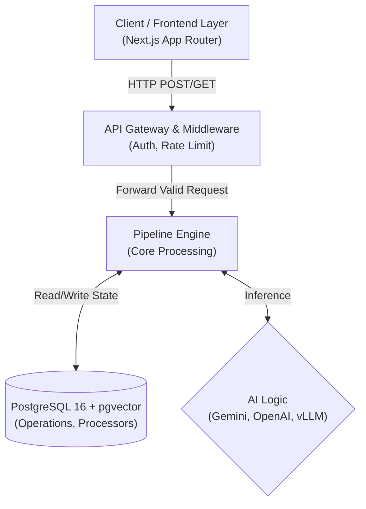
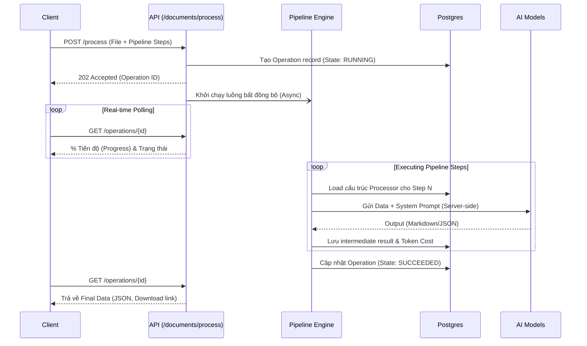

# Nhận định Kiến trúc Hệ thống: Dugate Document AI Suite

*Tài liệu đệ trình phê duyệt Kiến trúc (Architecture Design Document) cho thủ tục Go-Live.*

---

## 1. Tóm tắt Thực thi (Executive Summary)

**Dugate Document AI Suite** là nền tảng điện toán đám mây cung cấp các giải pháp chuyên sâu về xử lý tài liệu định dạng phức tạp (PDF, DOCX) thành dữ liệu có cấu trúc (Markdown, JSON). Dịch vụ không chỉ giải quyết bài toán OCR cơ bản mà còn áp dụng Generative AI tiên tiến (Gemini, OpenAI) để: Bóc tách thông tin (Extraction), So sánh ngữ nghĩa (Semantic Diff), Dịch thuật (Translation), Che mờ thông tin cá nhân (Redaction) và Phát sinh văn bản (Generation).

Kiến trúc hiện tại đã được nâng cấp sang mô hình **Hybrid Pipeline Architecture (Kiến trúc Luồng lai)**. Mục đích của đợt chuyển đổi kiến trúc này nhằm giải quyết các bài toán về:
- **Khả năng mở rộng (Scalability):** Chuyển từ việc hard-code từng endpoint cho mỗi tính năng (Fragmented APIs) sang việc sở hữu duy nhất 1 luồng Pipeline Engine linh hoạt.
- **Bảo mật (Security):** Tách biệt hoàn toàn System Prompt nội bộ khỏi sự truy cập của Client, triệt tiêu rủi ro Prompt Injection.
- **Trải nghiệm tích hợp (Developer Experience):** Đưa toàn bộ API tuân thủ tiêu chuẩn thiết kế quốc tế (AIP của Google và RFC 9457).

---

## 2. Sơ đồ Kiến trúc Tổng thể (High-level Architecture)

Hệ thống được thiết kế theo mô hình Monolith-First (chia khối module trong cùng một repo Next.js) nhưng sẵn sàng để scale thành Microservices nhờ tính độc lập của Pipeline Engine.



### 2.1. Các tầng (Layer) của Hệ thống:

1. **Client / Frontend Layer**
   - **Công nghệ**: Next.js 14 (App Router), React, Tailwind CSS. Hệ thống Design System đồng bộ với Guideline của tổ chức (Màu sắc Emerald Green, Crimson Red, Dark/Light Mode).
   - Tham gia giao tiếp với Backend thông qua Internal REST API (Bỏ qua cấu hình API Key đối với Web Client).
2. **API Gateway & Auth Layer**
   - **Proxy / Middleware**: Next.js Middleware đảm nhiệm việc xác thực `x-api-key` đối với public API (`/api/v1/*`), chặn các request không hợp lệ.
   - **Quản lý hạn mức (Rate Limit / Quota)**: Kiểm tra Quota của API Key trước khi cho phép Job chạy.
3. **Core API & Pipeline Engine (Application Layer)**
   - Triển khai thuật toán xử lý luồng `Engine.ts`.
   - Kết nối tới các Adapter cho định dạng file (Pandoc cho DOCX, PDF.js/Sharp cho PDF Vision).
   - Tích hợp **Switch-AI Container**: tự động fallback và routing provider LLM (Google Gemini, OpenAI, vLLM, Ollama).
4. **Data Persistence (Database Layer)**
   - **PostgreSQL 16** đi kèm extension **pgvector**.
   - **Prisma ORM** cho việc cấu trúc và migration database.
   - Hệ thống lưu trữ File (Local Storage trên `Uploads/` và `Outputs/` volume, sẵn sàng đổi sang S3 adapter trong tương lai).

---

## 3. Kiến trúc Thiết kế Dữ liệu (The Hybrid Pipeline Pattern)

Trái tim của hệ thống vừa được thiết kế lại xoay quanh 2 thực thể (Domain Models) cốt lõi:

### 3.1. `Processor` (Node Xử lý)
- **Định nghĩa**: Là một kịch bản AI phân giải sẵn trên Server. Ví dụ: `prebuilt-invoice`, `prebuilt-compare`, `prebuilt-layout`.
- **Đặc tả**: Lưu giữ System Prompt, JSON Response Schema, thông số Model (Temperature).
- **An toàn**: Client không định nghĩa Prompt. Client chỉ truyền các `variables` (biến) vào Processor.
  
### 3.2. `Operation` (AIP-151 Long Running Operation)
- **Định nghĩa**: Một bản ghi đại diện cho một "tác vụ đang chạy". Không giống như API đồng bộ (Synchronous) gây Timeout (đặc thù AI cần 10s - 30s), Pipeline hoạt động theo giao thức LRO.
- **Vòng đời State**: `RUNNING` ➔ `SUCCEEDED` hoặc `FAILED` hoặc `CANCELLED`.
- **Truy xuất**: Chứa cả input (File gốc) và output (Markdown, JSON Extracted Data), cùng dữ liệu thống kê mức giá (Tokens + Cost).

### 3.3. Pipeline Chain (Chuỗi luồng)
Chìa khóa của "Hybrid" nằm ở việc cho phép Client gửi một mảng tuần tự (Array) các Processors.
*Ví dụ thực tế:* 
- Bước 1: `prebuilt-layout` (Chuyển PDF hóa đơn sang Markdown thô).
- Bước 2: `prebuilt-translate` (Dịch Markdown thô sang tiếng Việt).
- Bước 3: `prebuilt-invoice` (Trích xuất các cột Markdown JSON).
Hệ thống Pipeline sẽ tự động chuyển output của Bước 1 làm input của Bước 2.

### 3.4. Sơ đồ trình tự Xử lý (Sequence Diagram)



---

## 4. Đặc tả Tiêu chuẩn Bộ API (API Specification)

Dugate API tuân thủ nghiêm ngặt các tiêu chuẩn Quốc tế:

- **AIP-136 (Custom Methods)**: `POST /api/v1/documents/process` biểu thị một hành động có tên miền rõ ràng (không đơn thuần là thao tác CRUD trên `document`).
- **AIP-151 (LRO)**: Trả về HTTP `202 Accepted` cùng header cấu trúc `Operation-Location: /api/v1/operations/id`.
- **AIP-155 (Idempotency)**: Cho phép truyền Header `Idempotency-Key` nhằm chống tính phí 2 lần nếu Client bị rớt mạng và gọi lại API upload tạo File trùng.
- **RFC 9457 (Problem Details)**: Tiêu chuẩn body báo lỗi thống nhất:
  ```json
  {
    "type": "https://dugate.vn/errors/invalid-pipeline",
    "title": "Invalid Pipeline JSON",
    "status": 400,
    "detail": "Processor 'xxx' does not exist."
  }
  ```

### Các Endpoints chính phục vụ Go-live:
1. `GET /api/v1/processors` - Khám phá các công cụ AI được kích hoạt hiện tại.
2. `POST /api/v1/documents/process` - Tạo mới Pipeline (Nhận file nhị phân qua `multipart/form-data`).
3. `GET /api/v1/operations` - Lịch sử xử lý theo tài khoản chứa phân trang con trỏ (Cursor Pagination).
4. `GET /api/v1/operations/{id}` - Polling endpoint kiểm tra kết quả (bao gồm Output JSON và Token cost summary).
5. `GET /api/v1/operations/{id}/download` - Download Stream thẳng ra định dạng file MD/HTML/JSON.
6. `POST /api/v1/operations/{id}/cancel` - Dừng dở dang quá trình (nếu Engine hỗ trợ abort controller).

---

## 5. Security & Billing (Bảo mật và Tính cước)

1. **Anti-Injection Boundary**: Giao quyền cho quản trị viên tạo Processor mẫu qua DB. Frontend và các tổ chức khách hàng (3rd Party) chỉ có quyền khai thác API dựa trên danh sách quy định.
2. **Usage Tracking**: Mọi Operation đều đếm từng Token (nhấn mạnh tiết kiệm ở Input và Output qua các Model). Thuật toán thống kê phân rã (Breakdown) theo `usageBreakdown` rõ ràng cho từng chặng (Step), phục vụ hoá đơn minh bạch cho B2B.
3. **Automatic Cleanup (Xóa rác tự động)**: Script cron `lib/cleanup.ts` sẽ xóa toàn bộ file nhị phân (`uploads`) và cache đệm trung gian (`outputs`) sau **24 giờ**, chỉ giữ định dạng trích xuất trong bảng `Operation` nhằm tuân thủ quy định lưu trữ dữ liệu rác trên Cloud.

---

## 6. Đánh giá Khả năng Khai thác Kỹ thuật Số (Go-Live Readiness)

Với kiến trúc mới, bản phân phối Dugate đạt đủ **3 yếu tố Go-Live**:
- **Độ tin cậy (Reliability):** File đầu vào bị hỏng ở giữa tiến trình không làm sụp đổ (Crash) toàn bộ Engine, Engine xử lý partial fail-skip gọn gàng.
- **Thoát phụ thuộc Model (Agnostic):** Không bị trói chân với Gemini. Engine Pipeline thuần Javascript chuẩn, dễ chuyển mạch Model AI sang OpenAI ở tầng Switch-Container `lib/ai/index.ts`.
- **Performance UX:** Thiết kế Polling API bằng việc cho ra trạng thái `$progressPercent` giúp phía Front-end render các Progress component thân thiện tuyệt vời mà không cần phải dựa dẫm vào Socket phức tạp ở giai đoạn 1.

**Kiến trúc đủ tin cậy để đưa vào vận hành trên môi trường Production.**
